# 📋 TransactAI — Full Project Audit Report

> **Audit date:** 2026-08-07 · **Scope:** Entire `TransactAI` repository · **Method:** exhaustive read of every tracked source/config/artifact file.
>
> Every conclusion below is grounded in actual code at the cited paths. Nothing is guessed; where something is missing, incomplete, or inconsistent, that is stated explicitly.
>
> **Big picture:** this is a *monorepo* containing **four loosely-coupled applications**:
> 1. **Python FastAPI backend** (`backend/`) — ML inference + REST API (the core).
> 2. **Flutter mobile frontend** (`frontend/transact_ai_mobile/`).
> 3. **Kotlin Android companion** (`TransactionNotifier/`) — a notification-listener app.
> 4. **Root-level legacy scaffolding** (`api/`, `core/`, `training/`, `test.py`, `cuda.py`) — historical copies that duplicate `backend/`.

---

## Table of Contents
1. [Executive Summary](#1-executive-summary)
2. [Project Structure](#2-project-structure)
3. [Architecture](#3-architecture)
4. [Backend Analysis](#4-backend-analysis)
5. [Frontend Analysis (Flutter)](#5-frontend-analysis-flutter)
6. [Android TransactionNotifier](#6-android-transactionnotifier)
7. [Database](#7-database)
8. [AI/ML System](#8-aiml-system)
9. [RAG System](#9-rag-system)
10. [Discovery Pipeline](#10-discovery-pipeline)
11. [API Documentation](#11-api-documentation)
12. [Configuration](#12-configuration)
13. [Security Audit](#13-security-audit)
14. [Performance Review](#14-performance-review)
15. [Code Quality](#15-code-quality)
16. [Testing](#16-testing)
17. [DevOps](#17-devops)
18. [Dependencies](#18-dependencies)
19. [Design Patterns](#19-design-patterns)
20. [Technical Debt](#20-technical-debt)
21. [Improvement Suggestions](#21-improvement-suggestions)
22. [Interview Preparation (50 Q&A)](#22-interview-preparation-50-qa)
23. [Resume Highlights](#23-resume-highlights)
24. [Portfolio Description](#24-portfolio-description)
25. [Repository Health Score & Final Verdict](#25-repository-health-score--final-verdict)

---

# 1. Executive Summary

**TransactAI** is a finance-tracking platform that automatically categorizes Indian banking / UPI / SMS payment notifications using a **hybrid ML triage**: a deterministic rule engine → a fine-tuned **DistilBERT** sequence classifier → a **SentenceTransformer** embedding fallback. The service is exposed via **FastAPI** and consumed by a **Flutter** mobile app and a Kotlin **Android** notification-listener app.

**Commendable strengths**
- A genuinely production-minded ML stack: DistilBERT fine-tuning via HF `Trainer`, three-signal fusion, ONNX export path, versioned model artifacts, prediction logging, per-class metrics and confusion-matrix analysis.
- Solid measured results: **test accuracy ~92.9%, weighted-F1 ~0.93**, MCC ~0.93 on a clean balanced 11-class dataset.
- Good engineering instincts in the ML core: parameterized `TrainingConfig`, disjoint train/val/test split guards, leakage checks, resource benchmarking, gradient-checkpointing + auto batch-size.
- Extensive documentation: README, API_DOCS, CONTRIBUTING.

**Critical problems** (priority order)
1. **The Android app cannot talk to the backend at all.** It POSTs to `/api/classify` with body `{"text": ...}`; the backend serves `/classify` at the **root** and requires `{"message" | "sms_text"}` → guaranteed **404 + 400**. See [TransactionNotifier/.../ApiClient.kt](TransactionNotifier/app/src/main/java/com/transactai/ApiClient.kt) vs [backend/api/main.py:216-226](backend/api/main.py#L216-L226). No data ever flows end-to-end.
2. **Security: private financial data moves in cleartext.** Cleartext HTTP (`usesCleartextTraffic="true"`, hardcoded LAN IP) + `HttpLoggingInterceptor(Level.BODY)` in the Android app; PIN stored **plaintext** in SharedPreferences in Flutter; DB credentials printed to startup logs; **no auth token attached to any Flutter API request**.
3. **Three competing database-access layers.** SQLAlchemy ORM (`db.py`), a legacy psycopg2 pool (`database.py` + `main.py` legacy block), and a *third* bespoke psycopg2 connection in `core/feedback.py` with a **different default password**. The `User` table exists but no endpoint uses it — the data layer is anonymous.
4. **Broken deployment artifacts.** `docker-compose.yml` builds the frontend from `./frontend/transaction_categorization`, a path that **does not exist** (real dir: `frontend/transact_ai_mobile`). `scheduler.py` calls `train_with_feedback` with its import commented out → `NameError` at first nightly run.
5. **Merge-conflict markers shipped in source.** [backend/api/main.py](backend/api/main.py) contains literal `<<<<<<< feature/frontend-fix`, `>>>>>>> main` blocks and duplicate code.
6. **Model / label vocabulary mismatch at runtime.** The rule engine can emit categories (`Travel`, `Healthcare`, `Education`, `Entertainment`, `Fund Transfer`) that are **not** in the model's 11-label vocabulary. In the no-model fallback path these pass through as final answers; in the model path they are silently nulled.

**Overall verdict:** A technically capable ML backend wrapped in a fragile, un-hardened application shell. The ML core and documentation are strong; the surrounding product scaffolding is inconsistent and partly unwired. **"Shovel-ready ML core, deployment-blocked application wiring."**

---

# 2. Project Structure

Full tracked-file inventory (excluding pure binary blobs such as `.apk`/images/`.lock`):

```
TransactAI/  (root — real entry points + legacy scaffolding mixed)
├── README.md                 # Product / architecture doc (accurate)
├── API_DOCS.md               # Documents 6 of the ~20 real endpoints
├── CONTRIBUTING.md           # Setup + contribution guide
├── docker-compose.yml        # ⚠ BROKEN: frontend build context doesn't exist
├── Dockerfile                # Builds `api.main:app` (root layout)
├── requirements.txt          # pinned lock (69 pkgs, OLDER versions)
├── .env.example  .gitignore  .dockerignore  .gitattributes (LFS)
├── create_tables.py          # Base.metadata.create_all
├── __init__.py               # empty
├── structure.txt             # stale 2 MB directory dump (committed junk)
├── test.py                   # CLI tester (older variant, works)
├── cuda.py  test_cuda.py     # GPU sanity scripts
├── training_entrypoint.py    # wrapper → re-imports backend.training
├── training/                 # ⚠ legacy duplicate (re-imports backend)
├── api/  core/  data/        # legacy copies (see §10)
│
├── backend/                          # ★ THE real Python service
│   ├── api/     main.py predict.py scheduler.py config.py db.py database.py
│   │            models.py schemas.py crud.py budget.py insights.py
│   ├── core/    preprocessor.py rules.py model.py inference.py fuzzy_utils.py feedback.py
│   ├── training/  train_model.py   evaluate.py (⚠ EMPTY)
│   ├── tests/     test_onnx_export.py test_training_entrypoint.py test_training_pipeline.py
│   ├── models/    classifier/ classifier_ckpts/  (+ LFS metrics)
│   ├── data/ (training xlsx)  outputs/  logs/  runs/
│   ├── requirements.txt  Dockerfile  .dockerignore  .env.example  .gitattributes
│   ├── create_tables.py  conftest.py  test.py test_cuda.py
│   └── transactions.db  # ⚠ stray SQLite blob committed to git
│
├── frontend/transact_ai_mobile/   # ★ Flutter app (Dart) + android/ + web/ + windows/
│   └── lib/
│       ├── main.dart           # entry + auth state machine
│       ├── firebase_options.dart
│       ├── models/ transaction.dart
│       ├── screens/ classify dashboard insights launch login pin profile signup sms_feed
│       ├── services/ auth_service pin_service sms_service api_service
│       ├── theme/ constants.dart
│       └── widgets/ balance_card donut_chart transaction_item
│   + pubspec.yaml  README.md  test/widget_test.dart
│
└── TransactionNotifier/           # ★ Kotlin Android NotificationListenerService
    └── app/src/main/java/com/transactai/
        ├── ApiClient.kt  MainActivity.kt  NotificationService.kt
        └── models/TransactionModels.kt
        + res/ (layouts, drawables, mipmaps, values, xml) · AndroidManifest.xml · build.gradle
```

**Structural observations**
- **Three separate front-ends exist** (Flutter mobile, Flutter web output, Kotlin native) — only the Flutter app talks to the backend correctly.
- **Duplicate scaffolding at root** (`api/`, `core/`, `training/`, `test.py`, `cuda.py`, root `requirements.txt`) shadows `backend/`. Every backend module carries `try: from backend.core… / except ModuleNotFoundError: from core…` dual-import fallbacks precisely because of this split.
- **`backend/transactions.db`** (SQLite) is committed to git even though the app uses PostgreSQL — a stray artifact.
- **Git LFS** is correctly configured (`.gitattributes`) for model weights, centroids, tokenizer files; it even tracks `*.json` (unusual but not harmful).

---

# 3. Architecture

### 3.1 High-level data flow

```mermaid
flowchart LR
    subgraph Sources["Transaction sources"]
        S1["Banking SMS / UPI \n(PhonePe, GPay, Paytm)"]
        S2["Kotlin NotificationListenerService\n(TransactionNotifier)"]
        F2["Flutter app — paste / SMS scan"]
    end

    subgraph API["FastAPI Backend (backend/api/main.py)"]
        R["Rule engine (core/rules.py)\nshort-circuit if conf ≥ 0.90"]
        T["DistilBERT classifier\n(core/model.py) if conf ≥ 0.70"]
        E["SentenceTransformer centroids\n(all-MiniLM-L6-v2) if < 0.70"]
        FUS["Fusion logic (_combine_with_embeddings)"]
    end

    subgraph Store["PostgreSQL"]
        txn[(transactions)]
        fb[(feedback)]
    end

    S1 --> F2
    S2 -. broken contract .-> R
    F2 --> R
    R --> T --> E
    R --> FUS
    T --> FUS
    E --> FUS
    FUS -->|category + confidence| CAT
    CAT --> txn
    CAT -. low conf .-> UI[User picks category]
    UI --> fb
    fb -->|nightly 3 AM / POST retrain-model| RET[training/train_model.py]
    RET -->|saves weights| BERT[(models/ dir)]
```



### 3.2 Inference pipeline (the heart — `core/model.py::predict_batch`)

1. **Rule engine** (`core/rules.py`) scores raw + cleaned text using keyword hits (+1), regex patterns (+1.5), and fuzzy matches (weighted). If a match has `confidence ≥ rule_threshold (0.90)` → emit immediately with `strategy="RULE"`. Otherwise the rule match is retained as a candidate signal.
2. **DistilBERT** (`distilbert-base-uncased`, 11 labels) classifies remaining texts; if softmax probability ≥ `ml_threshold (0.70)` → `strategy="ML"`.
3. **SentenceTransformer** (`all-MiniLM-L6-v2`) computes cosine similarity to per-class **centroids** saved during training (`_build_label_centroids`); used only for low-confidence ML predictions (embed threshold 0.60).
4. **Fusion** (`_combine_with_embeddings`) blends rule + ML + embedding with a weighted formula (`0.5·ml + 0.3·embed + 0.2·rule`, capped). If everything is weak → fallback category `"Others"` at confidence 0.35.

### 3.3 Inference backends (`core/inference.py`)
- `TransactionClassifier` — wraps `core/model.py`; if the model fails to load it degrades to rule-only, else `"Others"/0.35`.
- `TransactionPredictor` — production predictor exposing `predict`, `predict_top_k`, `explain` (captum Integrated Gradients), `set_temperature`.
- `ONNXTransactionPredictor` — ONNX Runtime session (CUDA→CPU providers), own `id2label` loader.
- `create_predictor(runtime)` selects `"onnx"` vs `"pytorch"` from env `TRANSACTAI_INFERENCE_BACKEND`.

### 3.4 Runtime wiring (`backend/api/main.py`)
- App object, CORS middleware, psycopg2 legacy pool, classifier loaded into `app.state.classifier` at startup, routers mounted (`/insights`, `/budget`, `/api/predict`, plus the main handlers).
- Startup hooks: `create_tables_on_startup()` (SQLAlchemy `create_all`) and the nightly scheduler thread.
- Categories list `CATEGORIES` (11 items) is **separate** from the model's 11 labels — order/labels differ slightly (see §8.4).

---

# 4. Backend Analysis

### 4.1 FastAPI app — `backend/api/main.py`
- Title "TransactAI API v2.0", CORS `allow_origins=["*", …]` with `allow_credentials=True`.
- **Endpoints defined here:** `GET /`, `GET /health` (GET+HEAD, for UptimeRobot), `POST /classify`, `POST /manual-category`, `POST /add-category`, `GET /transactions`, `GET /summary`, `POST /feedback` (legacy psycopg2), `POST /retrain-model`.
- **Routers mounted:** `/insights/*`, `/budget/*`, `/api/predict` and `/predict` (the same router included **twice**, once under `/api` and once at root).

**Bugs found in `main.py`**
1. **`/classify` overwrites `text`:** it reads `text = payload.get("sms_text") or payload.get("message")`, validates, then immediately overwrites with `text = payload.get("message")`. A client sending only `sms_text` gets a spurious 400. This is exactly why the Android app (which sends `{"text": ...}`) can never succeed — and even `sms_text` would be dropped.
2. **Merge-conflict markers** (`<<<<<<< feature/frontend-fix`, `>>>>>>> main`) still present — source ships with unresolved conflicts.
3. **`app = FastAPI(...)` constructed twice** in the file; duplicate `load_dotenv()`, duplicate psycopg2 pool block.
4. **`/classify` saves to DB only when `conf >= 0.6`** — a magic number separate from the model's 0.70 ML threshold; low-confidence results are returned to the user to pick a category (`/manual-category`).
5. **`/feedback` uses a second psycopg2 pool** and raw SQL `INSERT INTO transaction_feedback (user_id, original_text, predicted_category, corrected_category, confidence)` — but the ORM model is named `Feedback` with table `feedback` and totally different columns. **This handler will fail** against the ORM-created schema (see §7).
6. **`/retrain-model`** collects all `Feedback` rows, builds a DataFrame, and runs `train_with_feedback` in a `BackgroundTasks` worker, then reloads `app.state.classifier`. Reasonable — but the worker swallows exceptions (only prints).

### 4.2 Router: insights (`api/insights.py`)
- `GET /insights/monthly` (year/month, totals + category + daily breakdown)
- `GET /insights/weekly` (last N days, `days` 1–30)
- `GET /insights/daily` (single date transactions)
- `GET /insights/trends` (last N months totals)
- Clean ORM usage, parameterized date ranges, sensible validation (`ge/le` constraints). **No significant issues** — the best-written router.

### 4.3 Router: budget (`api/budget.py`)
- Creates `budgets` table via raw `CREATE TABLE IF NOT EXISTS` **at import time** (module side effect).
- `POST /budget/set` (upsert), `GET /budget/status` (budget vs spent, optional category), `POST /budget/reset`.
- Mixes raw SQL (`text()`) and ORM in one module — works, but inconsistent style; assumes `gen_random_uuid()` (PG 13+).

### 4.4 Background scheduler (`api/scheduler.py`)
- Handwritten `threading.Thread` daemon that sleeps until 3:00 AM, pulls all `Feedback` rows, and calls `train_with_feedback(...)`.
- **Critical bug:** the import is commented out — `# from training.train_model import train_with_feedback`. `train_with_feedback` is never bound in this module → **`NameError`** the first time it runs; the retrain silently never happens.
- Also reloads the classifier via `TransactionClassifier().load("models","classifier")` — but training saves into `backend/models/classifier`, and the scheduler runs from `backend/`, so the relative path is likely fine; still, path assumptions are fragile.

### 4.5 Prediction router (`api/predict.py`)
- `GET /api/health` (status + model_loaded), `GET /api/model` (reads `outputs/model/model_metadata.json`), `GET /api/benchmark` (reads `outputs/benchmarks/benchmark.json`), `POST /api/predict`, `POST /api/predict_top3`.
- Cleanly isolated; guards against missing classifier with 503.

### 4.6 `test.py` (backend CLI tester)
- Menu-driven tester calling `/classify`, `/manual-category`, `/add-category`.
- **Bug:** the "Login / Sign Up" menu calls `send_login(...)` and `send_signup(...)`, which are **never defined** → `NameError` if a user picks options 1 or 2.

---

# 5. Frontend Analysis (Flutter)

**Location:** `frontend/transact_ai_mobile/lib/` — 21 Dart files + `pubspec.yaml`.

**App purpose:** Android-first Flutter app that scans banking SMS (`flutter_sms_inbox`), sends texts to `/classify` on the hardcoded backend `https://transactai.onrender.com`, and shows a dark-themed dashboard, insights donut, budget and profile. Auth via Firebase (email, phone+OTP, Google) layered with a local 4-digit PIN + biometric.

**Architecture:** `main.dart` hosts an `AppStatus` state machine (`checking → launch → login → signup → locked → authenticated`); `TransactAIShell` renders a 4-tab bottom nav with a **60-second SMS polling timer** (`Timer.periodic`). Services (`api_service`, `auth_service`, `pin_service`, `sms_service`) are thin wrappers; screens are `StatefulWidget`s.

**Strengths**
- Clean model/screens/services/widgets/theme separation.
- Multi-provider Firebase auth (email, phone+OTP with 6-box OTP UI + resend timer, Google sign-in).
- Local PIN + biometric via `local_auth`.
- Polished custom painters (donut chart, geometric logo, Google "G").
- Centralized API client with friendly error mapping.

**Weaknesses (priority order)**
| # | Issue | Location | Sev |
|---|---|---|---|
| 1 | **PIN stored plaintext** in SharedPreferences, compared with `==`; no hash / secure storage / attempt throttling | `services/pin_service.dart` | 🔴 |
| 2 | **No auth token attached to any API request** — any caller who knows the backend URL can read/write all data | `services/api_service.dart` | 🔴 |
| 3 | **Hardcoded backend URL**, no env/config | `services/api_service.dart` | 🟠 |
| 4 | `listenToIncomingSms` is a **no-op stub** — the "real-time" snackbar flow is dead; SMS handled only by polling | `services/sms_service.dart` | 🟠 |
| 5 | Insights `categoryCounts` hardcodes `1` per category → every donut row says "1 transaction" | `screens/insights_screen.dart` | 🟠 |
| 6 | `getCategoryColor` hardcoded RGB **diverges from named constants** (donut vs badges inconsistent) | `theme/constants.dart` | 🟡 |
| 7 | Dashboard `Future.wait` — a single failing call drops the whole view to mock/offline fallback | `screens/dashboard_screen.dart` | 🟡 |
| 8 | Dead code: `balance_card.dart`, `transaction_item.dart`, `_ApiTransactionTile`, `_initRealTimeSmsListener` | multiple | 🟡 |
| 9 | iOS/macOS/linux Firebase `UnsupportedError`; `$` currency in two dead widgets vs `₹` elsewhere | | 🟡 |
| 10 | Login resend-timer recursion isn't cancelled on dispose (minor leak) | `screens/login_screen.dart` | 🟡 |

---

# 6. Android TransactionNotifier

A standalone Kotlin app using a **`NotificationListenerService`** to forward any detected banking/UPI notification text to the FastAPI categorizer.

**Files:** `ApiClient.kt`, `NotificationService.kt`, `MainActivity.kt`, `models/TransactionModels.kt`, `AndroidManifest.xml`, `build.gradle`, resources.

### 6.1 🔴 Fatal — App ↔ backend contract mismatch (the app can never work)
| App sends | Backend expects | Result |
|---|---|---|
| `POST http://10.254.244.112:8000/api/classify` | route `POST /classify` at **root** only | **404** |
| Body `{"text": "…"}` | `{"message" \| "sms_text"}` (`backend/api/main.py:216-226`) | **400** |

So `categorizeTransaction()` always returns `null`; every classification fails. This is the single most important cross-module defect in the repository.

### 6.2 Other critical issues (Android)
1. **`startForegroundService()` on a `NotificationListenerService`** (`MainActivity.startNotificationService`) → on API ≥ 26 Android throws `ForegroundServiceDidNotStartInTimeException` ~5 s later. NLS is a **bound** service started by the system when the user grants access; it must never be started with `startForegroundService`. The app will crash on real devices.
2. **Cleartext HTTP + full-body logging:** `usesCleartextTraffic="true"` + `HttpLoggingInterceptor(Level.BODY)` → amounts & payee info sent unencrypted **and** written verbatim to Logcat.
3. **No persistence:** Room is declared in `build.gradle` (2.6.1) but never used; the `Transaction` data class and `saveCategorizedTransaction()` are stubs (just a log). All classified data is discarded.
4. **High false-positive filter:** allowlists `com.whatsapp` and `com.amazon.in` unconditionally + generic keywords (`order`, `amount`, `account`, `payment`) → lots of junk classification.
5. **Weak amount regex:** `(₹|rs\.?|inr)\s*\d+` won't match `Rs. 1,234.00` or `₹1,23,456`.
6. **Hardcoded LAN IP** `10.254.244.112` with a "TODO: replace" comment; not configurable; works only on one network.
7. `READ_POST_NOTIFICATIONS` and `ACCESS_NOTIFICATION_POLICY` are declared but meaningless/unused; `allowBackup="true"` with no exclusion for a future Room DB.
8. Minor: `updateDebugInfo()` overwrites the appended debug log on every resume; `confidence ?: "N/A"` is dead code (non-nullable).

---

# 7. Database

**Primary store (as coded):** PostgreSQL, via **SQLAlchemy ORM** for transactions/feedback and raw SQL for budgets. A legacy psycopg2 pool coexists.

### 7.1 ORM models (`backend/api/models.py`)
- **`Transaction`** — UUID PK, `user_id` FK→users, `raw_text`, `clean_text`, `amount Numeric(12,2)`, `sender_name/phone`, `receiver_name/phone`, `txn_time DateTime`, `predicted_category`, `confidence Numeric(5,3)`, `source="mobile"`, `created_at`.
- **`Feedback`** — UUID PK, `message`, `clean_text`, `amount`, `receiver_name`, `chosen_category`, `created_at`.
- **`User`** — UUID PK, first/last_name, gender, `email` (unique), `phone` (unique), `password_hash`, `created_at`.

### 7.2 Schema drift — `feedback` table (major)
`core/feedback.py::FeedbackStore` creates a `feedback` table with `SERIAL` PK and columns `raw_text, cleaned_text, predicted_category, correct_category, confidence`. The ORM `Feedback` model uses **UUID** PK and columns `message, clean_text, amount, receiver_name, chosen_category`. These are **different schemas under the same table name**. The ORM-created table cannot satisfy `FeedbackStore`'s INSERT, and vice-versa. `core/feedback.py` is effectively dead code.

### 7.3 Redundant / conflicting DB connections (three)
| Layer | Mechanism | Location |
|---|---|---|
| SQLAlchemy engine + `SessionLocal` | `create_engine`, pool_pre_ping, pool_size 5 / max_overflow 10 | `api/db.py` |
| psycopg2 `SimpleConnectionPool` (legacy) | used by `/feedback` in main + exported helpers | `api/database.py` + `api/main.py` |
| Raw psycopg2 connection | `FeedbackStore`, default password `"admin"` | `core/feedback.py` |

Three separate strategies, two password conventions (`postgres` vs `admin`), inconsistent cleanup. `db.py` also **prints DB host/port/user/name to logs** (`print(f"[DB] HOST=…")`).

### 7.4 No user isolation
`User` table exists but **no endpoint creates or authenticates users** — auth happens in Flutter against Firebase only. All transactions live in one global namespace; `user_id` is always `NULL`.

### 7.5 Other DB notes
- `budgets` table created at import time by raw SQL (module side effect), `UNIQUE(year, month, category)` + `ON CONFLICT` upsert — fine.
- `/transactions`, `/summary`, insights all query without pagination depth limits beyond app-side `limit/offset`.
- A stray **SQLite** `backend/transactions.db` is committed but unused.

---

# 8. AI/ML System

### 8.1 Model & training artifacts (verified from committed JSON)
- **Architecture:** `distilbert-base-uncased`, 6 layers, 12 heads, hidden 768 — sequence classification head, 11 outputs.
- **Classes (11):** `Bills, Food, Fuel, Grocery, Medical, Refund, Salary, Shopping, Subscription, Transport, UPI_Transfer` (consistent across `label2id` / `id2label` / `metadata.json`).
- **Dataset:** 3300 rows, perfectly balanced (300 per class); avg message length 92.7 chars; duplicates removed; 70/15/15 split → 2310 / 495 / 495.
- **Measured (from `classification_report.json` / `classifier_metrics.json`):**
  - Test **accuracy 92.93%**, **weighted-F1 0.929**, macro-F1 0.851, MCC 0.926, balanced accuracy ~0.93.
  - Near-perfect classes (F1 ≈ 1.0): Bills, Food, Fuel, Grocery, Medical, Salary, Transport, UPI_Transfer.
  - **Weakest:** **Refund** — test recall 0.267 / F1 0.421; misclassified as **Shopping** 12× (val) and 18× (test) of 45 samples. **Shopping** is over-predicted (precision 0.692) — the "confusion sink".
  - **Suspicious signal:** `training_history.json` shows `eval_accuracy = 1.0` at **every** epoch checkpoint, yet final held-out validation is 93.3%. The in-training eval likely ran on the training split or a leaking eval set — worth verifying before trusting epoch-level metrics.
- **Benchmark (`model_metadata.json`):** CPU inference **~147 ms/sample**, **~34 samples/sec**. Slowish for real-time; ONNX/quantization not actually applied to the committed model.
- **Committed run config:** `export_onnx: false`, `quantize: false` (model_metadata.json) despite an ONNX export pipeline existing in code — the shipped model is PyTorch, not ONNX.

### 8.2 Save / load / centroids
`save()` writes weights + tokenizer + `metadata.json` (thresholds, max_length, embedder, temperature) + `label2id/id2label` + `label_centroids.pt`. `load()` restores everything including centroids. Clean and complete.

### 8.3 Training pipeline (`training/train_model.py`)
- `prepare_dataset`: multi-file load, fuzzy column detection, dedup, rare-label pruning (<2 samples), stats.
- `split_dataset`: stratified 70/15/15 **with explicit disjointness checks** to prevent leakage.
- `oversample_training`: RandomOverSampler (SMOTE/ADASYN gracefully downgraded to random — correct, since they don't fit raw text).
- `classifier.train`: HF `Trainer`, `WeightedTrainer` with optional class weights, gradient checkpointing, `_auto_batch_size` by VRAM, fp16/bf16 auto-selection, early stopping, TensorBoard.
- Post-train: versioned model dirs (`v1`, `v2`, …), `latest` + `classifier` copies, ONNX export + verification, confusion-matrix & F1 plots, benchmark + metadata JSON.

### 8.4 Vocabulary mismatch (runtime risk)
- Model labels (11): `…Transport, UPI_Transfer`.
- `CATEGORIES` in `main.py`: `…Transport, UPI_Transfer` (same set, different order).
- **Rule engine categories (15)**: includes `Travel`, `Healthcare`, `Education`, `Entertainment`, `Fund Transfer`, `Cashback`, `EMI`, `Interest`, `ATM Withdrawal` — several **not in the model's 11**.
  - In `core/model.py::predict_batch`, a rule match whose category isn't in `label2id` is **discarded** (`match = None`).
  - In `core/inference.py::TransactionClassifier.predict` fallback (model not loaded), a rule match is returned **as-is**, so categories like `Travel` flow to the client even though the model can never produce them.
  - The Flutter app's category-color map and `CATEGORIES` likewise differ from model labels → color/insights mismatches.

### 8.5 Prediction logging
`core/inference.py::_log_prediction` writes JSONL (model_used, category, confidence, latency) to `backend/logs/predictions/predictions.jsonl` when `TRANSACTAI_LOG_PREDICTIONS=1`. Good observability hook; off by default.

---

# 9. RAG System

> **Applicability:** TransactAI is **not** a retrieval-augmented **generation** system. There is **no** vector database, no document chunking, no retrieve-and-rerank pipeline, and no LLM generation step (the repo explicitly avoids LLM APIs).

**What exists that is RAG-adjacent:**
- The **SentenceTransformer** (`all-MiniLM-L6-v2`) is used as a **semantic-similarity fallback** against **label centroids** saved at train time — an in-memory nearest-centroid index over 11 classes. This is **centroid classification**, not RAG.
- `explain()` (`captum` Integrated Gradients) does token-attribution — feature explainability, not retrieval.

**Conclusion:** Do not describe this project as "RAG" in an interview or portfolio — that would be inaccurate. If you want a genuine RAG feature (e.g., a financial FAQ assistant that retrieves relevant docs/SMS and answers), that is a new feature, not something already in the repo.

---

# 10. Discovery Pipeline

> **Applicability:** There is **no** automated data-discovery / dataset-exploration pipeline (no scraping job, feature store, or source→DB discovery service).

**Closest equivalents in the repo:**
1. **Data acquisition inside training** — `prepare_dataset()` loads XLSX/CSV, fuzzy-detects text/label columns, cleans, dedups, prunes rare labels, and records statistics. This is the "discovery/ETL" stage for model data.
2. **Notification ingestion** — the Kotlin `NotificationService` + Flutter `SmsService` scan devices for financial SMS. The Kotlin path is broken end-to-end (§6); the Flutter path works via polling (§5).

If "Discovery" was meant to mean "how transactions get discovered & ingested," see §6 (broken) and §5 (working). If it means dataset discovery, the only discovery is inside `train_model.py`.

---

# 11. API Documentation

**Documented** (in `API_DOCS.md`, root + backend copy): 6 endpoints with request/response examples — `/classify`, `/manual-category`, `/add-category`, `/transactions`, `/summary`, `/retrain-model`. Example payloads are realistic UPI strings. Good, accurate documentation.

**Missing / undocumented endpoints that actually exist:**
- `POST /feedback` (legacy psycopg2)
- `GET /health`, `GET /`
- `/insights/monthly`, `/insights/weekly`, `/insights/daily`, `/insights/trends`
- `/budget/set`, `/budget/status`, `/budget/reset`
- `/api/health`, `/api/model`, `/api/benchmark`, `/api/predict`, `/api/predict_top3`

**Also missing:** auth documentation (there is none), error taxonomy, rate limits, versioning. FastAPI auto-generates `/docs` and `/redoc` (OpenAPI) — recommend treating those as source-of-truth and pruning the hand-written doc to avoid drift.

---

# 12. Configuration

| Config | Source | Notes |
|---|---|---|
| DB connection | env: `DB_HOST/DB_PORT/DB_NAME/DB_USER/DB_PASS` | `.env.example`: all `postgres`/`5432`/`transactai`; `db.py` defaults port `6543`, db `postgres` |
| Inference backend | `TRANSACTAI_INFERENCE_BACKEND` (`pytorch` \| `onnx`) | `inference.create_predictor` |
| Prediction logging | `TRANSACTAI_LOG_PREDICTIONS` (0/1) | JSONL to `logs/predictions/predictions.jsonl` |
| Category list | hardcoded `CATEGORIES` in `main.py` | 11 items; not persisted |
| ML thresholds | `metadata.json` in model dir | rule 0.90 / ml 0.70 / embed 0.60 |
| Docker secrets | `docker-compose.yml` | PG `postgres/postgres`; pgAdmin `admin@admin.com/admin` |

**Config anti-patterns:** backend URL hardcoded in both Flutter and Android; DB creds hardcoded in compose; category list in code; root vs backend requirements diverge; `core/feedback.py` default password `"admin"` disagrees with `.env` `postgres`.

---

# 13. Security Audit

Severity-ordered findings:

1. **🔴 Cleartext financial data + full request logging (Android).**
   - `usesCleartextTraffic="true"`, `BASE_URL = "http://10.254.244.112:8000"`, `HttpLoggingInterceptor(Level.BODY)`. Raw SMS/UPI text (amounts, payees) goes over unencrypted HTTP and is logged verbatim to Logcat.
2. **🔴 No server-side auth on any data endpoint.**
   - `/classify`, `/transactions`, `/summary`, `/feedback`, `/budget/*`, `/insights/*`, `/retrain-model` require **no authentication**. Combined with `allow_origins=["*"]` + `allow_credentials=True`, anyone who can reach the service can read/write transaction data and trigger retraining.
3. **🔴 Plaintext PIN + insecure login gate (Flutter).**
   - `pin_service.dart`: PIN stored raw in SharedPreferences, compared with `==`, no throttling/force-lock. The "authenticated" gate is a plain boolean, not a Firebase session check.
4. **🔴 DB credentials printed to logs.**
   - `backend/api/db.py` prints `[DB] HOST=… PORT=… NAME=… USER=…` on every startup.
5. **🟠 Feedback default password `"admin"`** in `core/feedback.py` (vs `postgres` everywhere else) — silent misconfiguration risk.
6. **🟠 Hardcoded secrets in `docker-compose.yml`** (Postgres + pgAdmin).
7. **🟠 Rule engine can emit out-of-vocab categories** (e.g. `Travel`) in the model-less fallback, bypassing the model's label space.
8. **🟠 No rate limiting / request-size fencing** on `/predict`-style endpoints.
9. **🟡 `allowBackup="true"`** with backup rules that don't exclude a future Room DB → transaction history could be cloud-backup'd.
10. **🟡 Privacy:** notification listeners read *all* apps' notifications — there's no explicit user consent copy beyond the OS permission dialog.

---

# 14. Performance Review

### 14.1 Measured latency
- `model_metadata.json` benchmark: **~147 ms/sample CPU, ~34 samples/sec**. Fine for interactive SMS triage; not real-time batch.
- ONNX/quantization exists in code but is **not** applied to the committed model (`export_onnx: false`).

### 14.2 Bottlenecks
| Area | Finding |
|---|---|
| Model load at startup | eager `from_pretrained` in module init — seconds of cold start |
| Text cleaning | `clean_batch` uses `ThreadPoolExecutor(max_workers=4)` on CPU-bound regex — limited gain, fine for small batches |
| `/summary` & insights | full scans / group-by over `transactions` with no indexes beyond PK/FK; fine at this scale, will degrade |
| FastAPI handlers | sync `def` → threadpool; acceptable for this traffic |
| `/transactions` | `limit/offset` page-ability exists but no count/per-page caps → unbounded memory on huge tables |
| Add-category | in-memory only; lost on restart |

### 14.3 Recommendations
- Export the committed model to ONNX (`python -m training.train_model --export-onnx`) and set `TRANSACTAI_INFERENCE_BACKEND=onnx` → expect ~3× CPU speedup.
- Add DB indexes on `txn_time`, `predicted_category`, `receiver_name` (the filtered columns).
- Lazy-load the classifier on first request instead of at import/startup.
- Cache embeddings/centroids (already cached as `centroid_matrix` — good).

---

# 15. Code Quality

**Strengths**
- `core/model.py` and `training/train_model.py` are genuinely production-grade: rich config, standard `Trainer` wiring, safety validators, metrics, artifact versioning.
- `preprocessor.py`, `rules.py`, `fuzzy_utils.py` are clean, well-named, documented.
- Consistent dual-import fallbacks (`backend.core.*` / `core.*`) let code run in either layout.
- Exception-aware error handling with meaningful messages throughout.

**Weaknesses**
- **Merge-conflict markers in source** (`<<<<<<<`, `>>>>>>>`) in `backend/api/main.py`.
- **Duplicate code:** `app = FastAPI()` twice, two psycopg2 pools, two `load_dotenv`, duplicated router includes.
- **Empty file:** `backend/training/evaluate.py` (0 bytes).
- **Dead code:** legacy psycopg2 pool, `FeedbackStore`, unused Flutter widgets, Kotlin `Transaction`/Room, `_ApiTransactionTile`, `_initRealTimeSmsListener`.
- **Root/backend duplication** of `api/`, `core/`, `training/`, `test.py`, `requirements.txt`.
- **Inconsistent currency** (`₹` vs `$`), multiple copies of `API_DOCS.md`, stale `structure.txt`.

**Code style:** No formatter/linter config (no `ruff`/`black`/`flake8` configs, no CI gate). Flutter has `analysis_options.yaml` (default flutter_lints).

---

# 16. Testing

| Test file | Path | Type | Covers | Effective? |
|---|---|---|---|---|
| `test_onnx_export.py` | `backend/tests` | unittest + mocks | ONNX verify path, export artifact creation | ✅ Good |
| `test_training_entrypoint.py` | `backend/tests` | unittest | `training.train_model` importable | ✅ Basic |
| `test_training_pipeline.py` | `backend/tests` | pytest | `prepare_dataset()` on committed `training_dataset.xlsx` | ⚠️ depends on data file |
| `widget_test.dart` | `frontend/.../test` | flutter test | trivial smoke | Weak |

**Gaps (significant):**
- **No API tests** — `/classify`, `/summary`, `/transactions`, `/feedback`, budget, insights, `/retrain-model` all untested.
- **No classifier unit tests** — `predict_batch` fusion, thresholds, rule short-circuit, fallback all untested.
- **No integration tests** — the Android↔backend contract mismatch shipped precisely because nothing tests it.
- **No CI** — no GitHub Actions workflow, so lint/tests never gate changes.
- `test_training_pipeline.py` requires the committed XLSX to exist → brittle.

**Recommendation:** `pytest` + FastAPI `TestClient` with a session-scoped in-memory/mock DB; parametrized classifier tests; a GitHub Actions matrix (lint → unit → build Docker).

---

# 17. DevOps

- **Backend Dockerfile** (`backend/Dockerfile`): `python:3.10-slim`, installs `build-essential` + `libpq-dev`, copies `requirements.txt` first (layer caching), `pip install --default-timeout=200 --retries=20`, copies app, `uvicorn api.main:app`. **Works.**
- **`docker-compose.yml`:**
  - `postgres:14` (hardcoded creds) + named volume `postgres_data`.
  - `backend` (builds `./backend`) with mounted `./backend/models` and `./backend/data`.
  - **`frontend` → `context: ./frontend/transaction_categorization` — this directory does not exist** (real: `./frontend/transact_ai_mobile`). **`docker compose up` fails at build time.**
  - `pgadmin` (hardcoded `admin@admin.com/admin`), `create_db` (runs `create_tables.py`).
- **No CI/CD** in the repo (no `.github/workflows`). Deployment to Render is referenced implicitly by the Flutter backend URL (`https://transactai.onrender.com`).
- **No monitoring/alerting** beyond `TRANSACTAI_LOG_PREDICTIONS` JSONL + `/health` (HEAD added for UptimeRobot).

---

# 18. Dependencies

- **Two requirements files, out of sync.**
  - Root `requirements.txt` (69 pkgs, older): `pandas 2.0.3`, `numpy 1.25.2`, `scikit-learn 1.2.2`, no `datasets/evaluate/onnx/onnxruntime`.
  - Backend `requirements.txt` (77 lines, newer): adds `datasets 2.20.0`, `evaluate 0.4.2`, `onnx 1.17.0`, `onnxruntime 1.20.1`, `sentencepiece`, newer `pandas 2.2.3`/`numpy 1.26.4`/`scikit 1.5.2`. The Dockerfile installs **only** the backend one.
- **Duplicate pins in backend requirements:** `torch==2.3.0` and `torch==2.3.1` both listed (pip resolves to the last); `tqdm==4.68.3` and `tqdm==4.67.1` both listed. Silent version ambiguity.
- **Compatibility:** `pydantic 1.10.x` + `fastapi 0.95.2` + `starlette 0.27.0` are consistent; `python-multipart 0.0.20` present (needed for forms).
- **Flutter (`pubspec.yaml`):** `firebase_core`, `firebase_auth`, `google_sign_in`, `local_auth`, `shared_preferences`, `http`, `intl`, `flutter_sms_inbox`, `permission_handler`. No state-management lib (setState-only); `flutter_lints` for analysis.
- **Android (`build.gradle`):** Retrofit 2.9.0, OkHttp 4.12.0, Gson, coroutines 1.7.3, lifecycle-ktx, **Room 2.6.1 (unused)**, viewBinding. No minify (no R8/proguard) in release.

---

# 19. Design Patterns

| Pattern | Where |
|---|---|
| **Fusion of weak experts** (rules + ML + embeddings) | `core/model.py::_combine_with_embeddings`, `predict_batch` |
| **Chain-of-responsibility / short-circuit** | rule fast-path tier before transformer |
| **Strategy / runtime dispatch** | `inference.py::create_predictor` (pytorch vs onnx) |
| **Dependency injection (DI)** | FastAPI `Depends(get_db)` throughout |
| **Singleton / shared state** | classifier stored on `app.state.classifier`; `TransactionClassifier` reused per process |
| **Pipeline / stage composition** | `clean_text_for_model` composed steps; `TransactionPreprocessor.clean_batch` |
| **Background worker** | nightly retrain daemon thread (`scheduler.py`) |
| **DTO schemas** | `api/schemas.py` (Pydantic) |
| **Versioned artifacts** | `next_model_version_dir` (v1, v2, …) + `latest` symlink-copy |

**Anti-patterns:** God-module `main.py` (though routers reduced it), duplicated infrastructure (3 DB layers), dead singletons (`FeedbackStore`), and magic numbers (0.6 save threshold vs 0.7 ML threshold).

---

# 20. Technical Debt

| # | Debt | Files | Impact |
|---|---|---|---|
| 1 | **Broken Android contract** (URL + body shape) | `ApiClient.kt` / `main.py` | One of three apps non-functional |
| 2 | **Merge-conflict markers in source** | `backend/api/main.py` | Unreviewed/ambiguous code shipped |
| 3 | **Three DB layers + schema drift** | `db.py` / `database.py` / `feedback.py` | Drift, credential mismatch, dead code |
| 4 | **Root scaffold duplicates backend** | `api/`, `core/`, `training/`, root `requirements.txt` | Import confusion, double maintenance |
| 5 | **Dead code & stubs** | `training/evaluate.py` (empty); `sms_service.listenToIncomingSms`; Flutter `balance_card`/`transaction_item`; Kotlin `Transaction`/Room | Faux features |
| 6 | **Hardcoded endpoints / secrets** | Flutter `api_service.dart`, Android `ApiClient.kt`, `docker-compose.yml` | Not environment-driven |
| 7 | **Untested cross-app contract** | — | Integration risk shipped |
| 8 | **No CI / lint gates** | — | Artifacts drift silently |
| 9 | **Stray `transactions.db` (SQLite) committed** | `backend/transactions.db` | Accidental addition |
| 10 | **`eval_accuracy = 1.0` in history vs 93%** | `training_history.json` | Unverified eval harness |
| 11 | **`/feedback` handler incompatible with ORM schema** | `main.py` | 500s on that endpoint |
| 12 | **`scheduler.py` NameError** | `scheduler.py` | Nightly retrain never runs |

---

# 21. Improvement Suggestions

**P0 — Make it actually work end-to-end**
1. **Fix the Android contract:** change `ApiClient.kt` to `BASE_URL = "https://<host>:8000/"` and send `{"message": text}` (or add a `/api/classify` route mirroring `/classify`). Pick one shape and align both sides.
2. **Fix `/classify` text override bug** in `main.py` (use `sms_text or message`, don't overwrite).
3. **Add auth to the backend** (JWT or API-key via a FastAPI dependency) and send the token from Flutter. No unauthenticated financial reads.
4. **Fix `scheduler.py`** — uncomment/import `train_with_feedback`.

**P1 — Clean-up & hardening**
5. **Collapse to one DB layer** — remove `database.py` and `feedback.py` psycopg2 paths; fix `/feedback` to use ORM or drop it.
6. **Strip merge markers & duplicate code** from `main.py`.
7. **Delete root duplicates** (`api/`, `core/`, `training/`, root `test.py`/`cuda.py`/`structure.txt`, `backend/transactions.db`).
8. **Store PIN hashed** (or `flutter_secure_storage`), add attempt throttling, gate auth on the Firebase session, and attach tokens in `api_service.dart`.
9. **Remove `usesCleartextTraffic`** and scoped `HttpLoggingInterceptor` in Android; remove `startForegroundService` (NLS binds itself).
10. **Fix `docker-compose.yml`** frontend context to `./frontend/transact_ai_mobile`.

**P2 — Model/platform**
11. **Export + ship ONNX** (`--export-onnx`, `TRANSACTAI_INFERENCE_BACKEND=onnx`) to cut CPU latency.
12. **Attack the Refund↔Shopping confusion** (18 test mislabels): more Refund samples, class weights, or a Refund-priority rule.
13. **Align category vocabularies** — rules / `CATEGORIES` / model labels / Flutter color map should share one source of truth.
14. **Investigate the `eval_accuracy=1.0` vs 93% discrepancy** (leakage in the eval split).

**P3 — Process**
15. **Add GitHub Actions:** `ruff`/`black` lint + `pytest` (unit + API) + Docker build.
16. **Add API tests** with FastAPI `TestClient` and a mock DB; add classifier fusion tests.
17. **Make `add-category` persistent** (DB-backed) and include it in retraining.
18. **Add an explicit user-consent + privacy note** for the notification-listener feature.

---

# 22. Interview Preparation (50 Q&A)

> These are short, repo-grounded answers. They are honest — including the project's flaws — because interviewers reward precise self-awareness.

**A. Architecture & product**
1. **What is TransactAI?** A finance app that automatically categorizes Indian banking / UPI / SMS notifications into spending categories using a hybrid ML pipeline (rules → DistilBERT → embeddings), served by FastAPI.
2. **Why "hybrid"?** Rules are free and deterministic for obvious cases; the transformer generalizes to unseen wording; embeddings rescue borderline-confidence cases. Three cheap signals beat any one.
3. **What were the three signals and their thresholds?** Rule engine (conf ≥ 0.90 short-circuits), DistilBERT (conf ≥ 0.70), SentenceTransformer centroid cosine (≥ 0.60, used when ML is below threshold). Final fallback = `"Others"` at 0.35.
4. **What is the 11-class label set?** Bills, Food, Fuel, Grocery, Medical, Refund, Salary, Shopping, Subscription, Transport, UPI_Transfer.
5. **How does the app discover transactions?** Flutter scans SMS via `flutter_sms_inbox` (60 s polling); the Kotlin app listens to OS notifications via a `NotificationListenerService` (currently broken end-to-end).
6. **What is the user flow?** Paste/SMS text → `/classify` → high confidence saved; low confidence shows category options → user corrects via `/manual-category` → feedback stored for retraining.
7. **How does retraining work?** Feedback rows accumulate; a 3 AM thread (or `POST /retrain-model`) runs `train_with_feedback`, re-trains, and hot-reloads `app.state.classifier`.
8. **Is there a RAG component?** No. The SentenceTransformer is a nearest-centroid fallback, not retrieval-augmented generation. There is no LLM in the product.
9. **What is the deployment target?** Docker Compose locally (Postgres + pgAdmin + backend) and Render for the hosted backend (per the Flutter URL).
10. **What are the app's three clients?** Flutter mobile (working), Flutter web output, Kotlin Android listener (broken contract).

**B. ML / modeling**
11. **Which model and why DistilBERT?** `distilbert-base-uncased` for 11-class sequence classification — ~40% smaller than BERT-base, near-equivalent accuracy, cheap to self-host without an API.
12. **How did you prepare the dataset?** 3300 balanced rows (300/class) from XLSX; fuzzy column detection; lowercasing; punctuation/noise removal; dedup; rare-label pruning.
13. **How did you split?** Stratified 70/15/15 with explicit disjointness checks between splits to prevent leakage.
14. **How did you handle class imbalance?** The dataset is balanced, but the pipeline supports RandomOverSampler and optional class weights; SMOTE/ADASYN are downgraded to random (correct — they don't fit raw text).
15. **What were the final metrics?** Test accuracy 92.93%, weighted-F1 0.929, macro-F1 0.851, MCC 0.926.
16. **What was the weakest class and why?** Refund (test recall 0.267) — heavily confused with Shopping, which is the over-predicted "sink" class.
17. **How did you diagnose the Refund problem?** Confusion matrices showed Refund→Shopping 18/45 on test; I would add Refund samples, class weights, or a higher-priority Refund rule.
18. **What is the fusion formula?** When embedding agrees with ML: `0.5·ml + 0.3·embed + 0.2·rule`, capped; when embedding disagrees: weighted blend favoring the higher signal, capped.
19. **How are centroids computed?** Mean of normalized `all-MiniLM-L6-v2` embeddings per class over the training set, then L2-normalized; inference uses cosine similarity.
20. **What did you export to ONNX?** A dynamic-batch ONNX export (`torch.onnx.export`, opset 14) with `input_ids`/`attention_mask` inputs, verified with `onnx.checker` and an ONNX Runtime session. *Honesty note:* the committed model was exported with `export_onnx: false`, so the ONNX path is validated in code but not shipped.
21. **How do you explain predictions?** `captum` Integrated Gradients over token embeddings returns top contributing tokens.
22. **What is prediction logging?** JSONL of model_used/category/confidence/latency when `TRANSACTAI_LOG_PREDICTIONS=1`.
23. **What would you do to improve accuracy?** Fix the eval-leakage suspicion (`eval_accuracy=1.0` in history), balance Refund, and align the rule vocabulary with the model.
24. **How do you version models?** `next_model_version_dir` creates `v1`, `v2`, …; `latest` and `classifier` copies are written alongside.
25. **How did you benchmark?** Time-per-batch + single-sample latency + throughput; recorded in `benchmark.json` (147 ms, 34 samples/s on CPU).

**C. Backend engineering**
26. **How is the FastAPI app structured?** Routers (`insights`, `budget`, `predict`) + inline handlers; SQLAlchemy `SessionLocal` DI via `Depends(get_db)`; classifier in `app.state`.
27. **What endpoints exist?** `/classify`, `/manual-category`, `/add-category`, `/transactions`, `/summary`, `/feedback`, `/retrain-model`, `/health`, `/insights/*`, `/budget/*`, `/api/predict*`.
28. **How do you store feedback?** `POST /manual-category` writes both a `Transaction` (with the user's category) and a `Feedback` row for retraining.
29. **What DB do you use and why?** PostgreSQL — UUID PKs, `Numeric` amounts, `TIMESTAMPTZ`; connection pooling with `pool_pre_ping`.
30. **What is the feedback loop?** Manual correction → Feedback table → nightly/on-demand retrain → model hot-reload.
31. **What is the biggest backend flaw?** The legacy `/feedback` psycopg2 handler targets a table schema that doesn't match the ORM `Feedback` model — it 500s against the real schema.
32. **How would you add auth?** A FastAPI dependency verifying a JWT (or API key) header; store hashed credentials; scope transactions per `user_id`.
33. **How do you handle background work?** FastAPI `BackgroundTasks` for retraining and a daemon thread for the nightly job (the latter currently has a `NameError` bug).
34. **What did you learn about preprocessing?** Regex for ₹/Rs/INR amounts and merchant extraction is fragile — commas, decimal formats, and Hinglish spellings need normalization.
35. **How is CORS configured?** `allow_origins=["*", …]` with `allow_credentials=True` — which browsers disallow with `*`; should be tightened.

**D. Frontend & mobile**
36. **What does the Flutter app do?** SMS scan/classify, dashboard, insights donut, budget, profile with PIN + biometric, Firebase auth.
37. **How is auth implemented?** Firebase Auth (email, phone+OTP, Google); local `shared_preferences` PIN as a second gate.
38. **What is the biggest Flutter security flaw?** The PIN is stored **plaintext** and compared with `==`; API calls carry **no token**.
39. **How does the Android app capture notifications?** `NotificationListenerService.onNotificationPosted` → extracts title/text/bigText → heuristic filter → API call.
40. **Why is the Android app broken?** It POSTs to `/api/classify` with `{"text": …}` but the backend serves `/classify` expecting `{"message"|"sms_text"}` → 404 + 400.
41. **What would you fix in the Android app?** URL, body shape, cleartext→HTTPS, remove `startForegroundService` on the NLS, implement Room persistence, tighten the notification filter.
42. **How do you render the donut chart?** A `CustomPainter` with animated sweep angles; it has minor arithmetic/resolution quirks and `categoryCounts` is hardcoded to 1.

**E. Security & ops**
43. **Name the top three security issues.** (1) No auth on any backend endpoint; (2) cleartext financial data + full request logging in Android; (3) plaintext PIN in Flutter.
44. **What would you do first if you owned this repo tomorrow?** Make the Android↔backend contract work, add auth end-to-end, then collapse the three DB layers into one.
45. **How would you deploy this safely?** HTTPS-terminating proxy, secrets in env not compose, auth on all routes, ONNX runtime for CPU, CI lint+test gate.
46. **What is your monitoring story?** Currently just `/health` (GET+HEAD for UptimeRobot) and optional prediction JSONL. I'd add structured logs + latency alerts.
47. **How do you handle schema migrations?** There's no Alembic; tables are `create_all`/raw DDL. I'd introduce Alembic for the `transactions`/`feedback`/`budgets` schemas.

**F. Judgement & lessons**
48. **What's the project's best engineering decision?** The three-signal hybrid with a rule fast-path — it's cheap, auditable, and explainable.
49. **What's the biggest technical debt?** The fragmentation: three DB layers, root/backend duplication, and an unwired Android client.
50. **How do you rate the repository?** 6.2/10 — strong ML core and docs, but broken integration, no auth, no CI, and scattered dead code. With the P0/P1 fixes it would reach 8/10.

---

# 23. Resume Highlights

**ML Engineering**
- Built a **hybrid transaction classifier** (deterministic rules → fine-tuned DistilBERT → SentenceTransformer centroid fallback) achieving **92.93% test accuracy / 0.929 weighted-F1** on 11-class Indian banking SMS categorization.
- Designed a production training pipeline: stratified 70/15/15 splits with leakage guards, RandomOverSampling, class weights, early stopping, gradient checkpointing, auto batch-size by VRAM, fp16/bf16, model versioning (`v1`, `v2`, …), and resource benchmarking.
- Implemented **ONNX export with verification**, top-k predictions, and **captum-based token-level explanations**.

**Backend / API**
- Delivered a **FastAPI + PostgreSQL** service: `/classify`, manual-category feedback loop, budgets, insights (monthly/weekly/daily/trends), and an on-demand retraining endpoint with hot model reload.
- Built a **feedback-driven retraining loop**: user corrections are stored and fed back into nightly/on-demand retraining.

**Multi-Platform Delivery**
- **Flutter** app: Firebase multi-provider auth, local PIN + biometric, SMS ingestion, dashboard, donut insights.
- **Kotlin** Android `NotificationListenerService` companion for real-time notification capture.
- **DevOps:** Docker + Docker Compose (backend/Postgres/pgAdmin), Git LFS for model artifacts, Render deployment.

**Outcomes you can cite:** 92.9% accuracy · 0.929 F1 · ~147 ms CPU inference · 11 classes · 3 clients · full retraining loop.

---

# 24. Portfolio Description

> **TransactAI — a local-first hybrid transaction categorizer.**
>
> TransactAI turns raw Indian banking SMS into a clean, categorized spending feed — without relying on any closed LLM API. Instead it blends a fine-tuned **DistilBERT** classifier with a deterministic rule engine and an embedding-based fallback, so it stays small, fast, and fully self-hostable. I built it end-to-end to prove a lightweight open model can beat "big API" alternatives on noisy, Hinglish-flavored banking notifications.
>
> The repo shows the full journey: domain-aware text preprocessing → stratified training with oversampling → evaluation with confusion-matrix analysis → ONNX export → REST serving → a feedback-driven retraining loop — plus two mobile clients (a Flutter app and a Kotlin notification listener). It's honest about its rough edges: the Android listener needs wiring to the current API contract, auth is the top missing layer, and the codebase carries legacy scaffolding that should be consolidated.

---

# 25. Repository Health Score & Final Verdict

**Health Score: 6.2 / 10**

| Area | /10 | Rationale |
|---|---|---|
| ML core | 9.0 | benchmarked, clean training, fusion, ONNX, explanations |
| Documentation | 8.0 | strong README / API / contributing |
| Backend structure | 5.0 | 3 DB layers, merge markers, dead legacy paths |
| Frontend (Flutter) | 6.0 | good UX & code split; no auth token, plaintext PIN |
| Android | 3.0 | broken contract, cleartext, no persistence |
| Security | 4.0 | unauthenticated endpoints, cleartext financial data, plaintext PIN |
| DevOps | 4.0 | broken compose frontend service, no CI |
| Testing | 3.0 | few unit tests; API/classifier/integration untested |

**Final Verdict**

> TransactAI has a **shovel-ready ML core** and genuinely good documentation, but the **application wiring is deployment-blocked**: the Android client cannot reach the API as written, the Docker Compose stack fails to build, the nightly retrainer is broken by a commented-out import, and several critical security gaps (no auth, cleartext financial data, plaintext PIN) prevent production use. The measured model quality (92.9% accuracy, 0.929 weighted-F1) is real and defensible.
>
> **Label:** *"Shovel-ready ML core, deployment-blocked application wiring."* With the P0 fixes (§21) — fix the Android contract, add auth, unify the DB layer, and repair the compose file — this repo would credibly rate **8/10**.

---

*Report generated from a complete read of the repository. All file paths are relative to the repo root. No code changes were made.*
